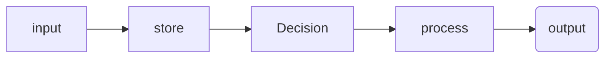
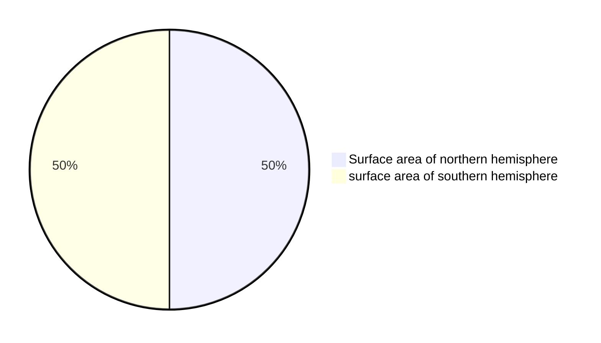

All computers: input-->store-->process-->output

# Stuff to remember
-  computing device is a physical artifact that can run a program. Some examples include computers, tablets, servers, routers, and smart sensors.
- Computers use binary because their hardware is based on two states (on/off), making it efficient to store and process all types of data, including images and text, as sequences of 0s and 1s.

- A single effect can be viewed as both beneficial and harmful by different people, or even by the same person.

- **Algorithm:** An algorithm is a finite set of instructions that accomplish a specific task. Every algorithm can be constructed using combinations of sequencing, selection, and iteration.
- **Arguments:** The values of the parameters when a procedure is called.
- **Collection type:** Aggregates elements in a single structure. Some examples include: databases, hash tables, dictionaries, sets, or any other type that aggregates elements in a single structure.
- **Data stored in a list:** Input into the list can be through an initialization or through some computation on other variables or list elements.
- **Input:** Program input is data that are sent to a computer for processing by a program. Input can come in a variety of forms, such as tactile (through touch), audible, visual, or text. An event is associated with an action and supplies input data to a program.
- **Iteration:** Iteration is a repetitive portion of an algorithm. Iteration repeats until a given condition is met or for a specified number of times. The use of recursion is a form of iteration.
- **List:** A list is an ordered sequence of elements. The use of lists allows multiple related items to be represented using a single variable. Lists are referred to by different terms, such as arrays or arraylists, depending on the programming language.
- **List being used:** Using a list means the program is creating new data from existing data or accessing multiple elements in the list.
- **Output:** Program output is any data that are sent from a program to a device. Program output can come in a variety of forms, such as tactile, audible, visual, movement, or text.
- **Parameter:** A parameter is an input variable of a procedure. Explicit parameters are defined in the procedure header. Implicit parameters are those that are assigned in anticipation of a call to the procedure. For example, an implicit parameter can be set through interaction with a graphical user interface.
- **Procedure:** A procedure is a named group of programming instructions that may have parameters and return values. Procedures are referred to by different names, such as method, function, or constructor, depending on the programming language.
- **Program code segment:** A code segment refers to a collection of program statements that are part of a program. For text-based, the collection of program statements should be continuous and within the same procedure. For block-based, the collection of program statements should be contained in the same starter block or what is referred to as a "Hat" block.
- **Program functionality:** The behavior of a program during execution, often described by how a user interacts with it.
- **Purpose:** The problem being solved or creative interest being pursued through the program.
- **Selection:** Selection determines which parts of an algorithm are executed based on a condition being true or false. The use of try/exception statements is a form of selection statements.
- **Sequencing:** The application of each step of an algorithm in the order in which the code statements are given.
- **Student-developed procedure / algorithm:** Program code that is student developed has been written (individually or collaboratively) by the student who submitted the response. Calls to existing program code or libraries can be included but are not considered student developed. Event handlers are built-in abstractions in some languages and will therefore not be considered student-developed. In some block-based programming languages, event handlers begin with "when".

=======
## Binary 
- maxiumum states `2^n` or  ${2^n}$

- highest value it can represent: `2^n - 1` ${{2^n}-1}$

## Program ideas
- [ ] Random name list selector

- [ ] A program where the user enters assignment scores and gets a final grade.
        - User interface: prompts for scores
        - List: stores all entered scores
        - Function with parameter: calculate_average(scores_list)
        - If-statement: determine letter grade based on average
        - Loop: keep adding scores until user stops

- [ ] Budget Tracker
        - The user enters expenses and the program tracks totals.
        - List: store expense entries.
        - Function: add_expense(amount) with a parameter.
        - If-statement: warn if budget limit is exceeded.
        - Loop: allow repeated entries.

- [ ] Temperature Converter with History
        - The user enters temperatures to convert between Celsius/Fahrenheit.
        - List: store all conversions.
        - Function: convert(temp, scale) with a parameter.
        - If-statement: check which scale to convert from.
        - Loop: allow multiple conversions.

- [ ] Character Creator
        - The user builds a character with traits.
        - List stores traits or past characters.
        - Function takes a trait and applies it.
        - If-statement checks for incompatible traits.
        - Loop continues until character is complete.

- [ ] Travel Packing Assistant
        - The user enters items they want to pack.
        - List stores items.
        - Function takes an item and category.
        - If-statement checks for duplicates.
        - Loop continues until packing is complete.

 
## Key terms

Sampling ‼️  IMPROVE ‼️ 
> is converting an analog signal to a digital one (p150)

Analog data  〰️ 
> has values that change smoothly over time and are continuous signals (p150)

Digital 1️⃣ / 0️⃣ 
>  data is a analog signal that has been broken up into steps and are discreet time signals (p150)

Abstraction 📚 
>  ~are when bits are grouped to find common fetures and can shrink the size of the code (p149)~
> is a simplified representation of something complex that hides unnecessary details, allowing us to focus on high-level operations or ideas.

Binary 1️⃣0️⃣0️⃣1️⃣
> is a way of representing information using only two options.

Bit 0️⃣
> (binary digit) is a single unit of information in a computer, typically represented as a 0 or 1.

Lossless compression  🌕
> reduces file size without losing any information. The original data can be perfectly reconstructed.

Lossy compression 🌔
> reduces file size by removing some data, resulting in a loss of quality. The original data cannot be perfectly restored.

intellectual property 
> any intangible creations of the mind, such as inventions, artistic works, designs, brand names, and symbols.

creative commons 
> a license that allows you to freely use materials created by others.

ASCII (American Standard Code for Information Interchange) 
>  a character encoding standard that assigns numbers to letters, digits, and symbols so computers can represent and process text.

A pixel 
> the smallest unit of a digital image, representing a single point of color or shade.

bitmap 
> a way of representing an image as a grid of pixels, where each pixel's value is stored in binary. For black and white images, each pixel is typically 1 bit.

RGB 
> stands for Red, Green, Blue. In digital images, each pixel's color is created by combining different intensities of these three colors, usually with 8 bits per channel.

Computing Device
> electronic machines that perform tasks automatically by executing instructions, enabling them to process, store, and analyze data

Computing System
> a combination of physical components (hardware) and instructions (software) that work together to perform tasks, such as receiving, storing, processing, and transmitting information

Computing Network
> a collection of two or more interconnected computing devices that share data, resources, and services using physical or wireless connections and agreed-upon communication protocols

Path
> a string of characters that specifies the unique location of a file, directory, or other resource within a file system or a hierarchical structure

Bandwidth
> the maximum theoretical amount of data that can be transmitted over a communication channel within a given period of time, typically measured in bits per second (bps)

Transmission Control Protocol (TCP)
> defines how computers sends data packets to each other. guides how data is subdivided into packets before transmission. 

User Datagram Protocol (UDP)
> allows computers to send messages without checking for missing packets to save time. this makes UPD less reliable but faster than TCP.

Sequential Computing
> problem is broken into discrete instructions then executed one by one by a single device having a single CPU

Parallel Computing
> problem is broken into discrete instructions then executed concurrently by using multiple CPUs. it is used for real world simulations and modeling.

Distributed Computing
> multiple devices used to run a program. Used to solve problems faster and allows problems to be solved that would be impossible for a single computer.

Router
> a network device that connects two or more separate networks, such as a home network to the Internet, by forwarding data packets to their correct destinations.

Switch
> a switch is a networking device that connects multiple devices on a single local area network (LAN) and directs data traffic to the correct destination using a Media Access Control (MAC) address.

Packet
> a small, standardized unit of data used to transmit information across a network, like the internet.

Firewall
> a security system that acts as a barrier between a trusted network and an untrusted network.

Internet Protocol (IP)
> the fundamental network protocol that governs how data is routed and addressed across the internet and other networks.

Domain Name System (DNS)
> acts as the internet's "phonebook," translating human-friendly domain names into machine-readable IP addresses.

HyperText Transfer Protocl (HTTP)
> the underlying set of rules, or protocol, for data transfer over the internet, enabling web browsers (clients) to request and retrieve resources like web pages, images, and videos from web servers.

Expression
> a combination of operators and values that evaluates to a single value.

Variable
> holds one value at a time.
> a reference to a value (or value that results from evaluation an expression) that can be used repeatedly throughout a program.

Assignment Operator
> allows a program to change the value represented by a variable.

Correlation
> statistical measure showing how two or more variables change together, indicating the strength and direction of their relationship.

Metadata
> data about data, providing context, description, and management info for other data, making it easier to find, use, and organize.

Filter
> create a subset of elements from the original list

Reduce
> reduce the list down to a single element, for example: the smallest number in the list

Map
> add or change each item in a list.

Argument
> The values of the parameters when a procedure is called.

Parameter
> A parameter is an input variable of a procedure. Explicit parameters are defined in the procedure header. Implicit parameters are those that are assigned in anticipation of a call to the procedure. For example, an implicit parameter can be set through interaction with a graphical user interface.

Return
> returns an object to where it was called from.

Procedural Abstraction
> provides a name for a process and allows the rocedure to be used only knowing what it does, and not necessarily how it does it.

Modularity
> the subdivision of a computer program into seperate subprograms.

Library
> a function collection of functions that can be used in many different programs.

API
> (Application Program Interface) are specifications for how the functions in a library behave and can be used.

Rogue Access Point
> Any unauthorized wireless access point or router connected to a secure network without administrative approval.

Malware
> Any software code, program, or script intentionally designed to disrupt, damage, gain unauthorized access to, or steal information from computer systems and networks.

Phishing
> A social engineering cyberattack where attackers masquerade as trusted entities via emails, messages, or websites to trick users into revealing sensitive information.

Keylogging
> A keylogger (keystroke logger) is a hardware or software tool that secretly records every keystroke made on a computer or mobile device without the user's consent.

Encryption
> a process of encoding messages to keep them secret, so only "authorized" parties can read it.

Decryption
> a process that reverses encryption, taking a secret message and reproducing the origional plain text.

Cipher
> the generic term for a technique (or algorithm) that performs encryption.

Caesar's Cipher
> a technique for encryption that shifts the alphabet by some number of charcters.

Cracking encryption
> when you attempt to decode a secret message without knowing all the specifics of the cipher, you are trying to crack the encryption.

Efficiency
> a measure of how many steps are needed to complete an algorithm

Linear Search
> a search algorithm which checks each element of a list, in order, until the desired value is found or all elements in the list have been checked.

Binary Search
> a search algorithm that starts at the middle of a sorted set of numbers and removes half of the data; this process repeats until the desired value is found or all elements have been eleminated.

Reasonable Time
> Algorithms with a polynomial efficiency or lower (constant, linear, square, cube, etc.) are said to run in a reasonable amount of time. (N^2, N^3, N * N)

Unreasonable Time
> Algorithms with expnential or factorial efficiencies are examples of algorithms that run in an unreasonable amount of time. (^N, N!)

Heuristic
> provides a "good enough" solution to a problem when an actual solution is impractical or impossible.

Undecidable Problem
> a problem for which no algorithm can be constructed that is always capable of providing a correct yes-or-no answer.

Speedup
> Sequential time divided by paralled time.

Run-Time error
>  a program error that occurs while software is running, often causing it to crash or behave unexpectedly after passing initial checks.

## Revision
- Test these
- go through each unit and get unit vocab e.g. https://studio.code.org/courses/csp-2025/units/1/vocab
- review program before exam, input, output etc
- written resposne prompts samples before submitting

## Program task - 30%
+ Submit to AP digital portfolio

## Submision
+ program code - can be collaborative ok with another student
    + Must take input from (a user e.g. an event trigger, a device, an online data stream, a file)
    + Must use at least one list or other collection type, to represent stored data and used to manage program complexity and fulfil programs purpose
    + At least one procecure the contrinutes to the programs purpose where you have defined:
        + The procedure name
        + the return type (if applicable)
        + one or more parameters
    + An algorithm that includes sequencing, selection and iterationt that is in the body of the selected procedure
    + A Call to this procecure 
    + Instructons of output (tactile, audible, visual or textual) based on input and progtams functionality
+ Video requirements: MP4, AVI, MOV, WEBM, WMV
    + must demosntrate program running including:
        + input to program
        + at least one aspect of the functionality of the program
        + Output produced
    + must not:
        + contain uer distinguishing info
        + Voice narration (text captions are OK)
        + Longer than 1 minute
        + Greater than 30MB
+ Personalised project reference - code for procedure and list - no comments here, provided to student for exam
    + Capture and paste two program code segments that contain the prodecure that imlenents the algorthm used in the ptogram
    + The first segment must be a student developed procedure that:
        + defines the procedure name and return type (if applicable)
        + Contains ans uses one or more parameters that have an effect on the functionality of the procedure
        + Implements an algorithm that includes sequencing, selecion and iteration
    + The second code segment must show where your student developed procedure is being called in the program
    + List: capture and paste two program code segments you developed as part of this task that contain a list (or other collection type) being used to manage complexity in your program
        + The first segment: show how data have been stored in the list
        + THe second: must show data in same list being used e.g. creating new data form the existing data or accessing multiopel elements in the last as part of fulfilling program purpose
 

## Exam - 70%
+ 2 hours of 70 multiple choice questions
+ 1 hour for 4 written response questions on the program task:
    + program design, function and purpose - 
    + Algorithm development
    + Errors and testing
    + Data and procedural abstraction

The performance task written resposne uses the following key verbs:
1. Capture:  select a portion of the program code that addresses the prompt(s)
2. Demonstrate: Provide evidence for an asnwer of point being made
3. Describe: provide the relevant features or characteristics of what the program code respresents of is being used to accomplish
4. Design: Develpp a plan for how to accomplish the prigram specification or requirements
5. Explain: provide the how or why something occurs, listing detail step of an algorithm of evidence and/or reasoning
6. Identify: Provide a name for the specific topic without elaboration or explanation
7. Implement/write: recognise and use the proper syntax to execure the program design

## Big Ideas Exam Weighting
+ Big Idea 1: Creative Development 10-13%
+ Big Idea 2: Data 17-22%
+ Big Idea 3: Algorithms and Programming 30-35%
+ Big Idea 4: Computer Systems and Networks 11-15%
+ Big Idea 5: Impact of Computing 21-26%

## Important info
- ap class room task: 
    - https://apstudents.collegeboard.org/ap/pdf/ap-digital-portfolio-terms-and-conditions.pdf
    - https://apcentral.collegeboard.org/courses/ap-computer-science-principles/course/faq/plagiarism-policy

## Example markdown
> [!NOTE]
> Useful information that users should know, even when skimming content.

> [!TIP]
> Helpful advice for doing things better or more easily.

> [!IMPORTANT]
> Key information users need to know to achieve their goal.

> [!WARNING]
> Urgent info that needs immediate user attention to avoid problems.

> [!CAUTION]
> Advises about risks or negative outcomes of certain actions.

# 2024 AP Computer Science Principles Free-Response Questions: Set 1

Q1) Programs accept input to achieve their intended functionality. Describe at least one valid input to your program and what your program does with that input
>   one vaild input to my program would be 90. this would be taken by the program and appended to an empty listOfScores. this list stores all scores that a user has input from the range 0 to 100 (inclusive) so that my student developed procedure can take an average of all the scores input and return a letter grade associated with this average. if only the score 90 was input and the user clicked the finalise button the average that would be 90 which would result in the letter grade "A" being returned to the user. if the score 90 was input along with the score 80, the procedure would average the scores to 85 and return the letter grade "B". Therefore, depending on the scores that were input by the user the program will return the letter grade associated with the average of all the scores input.

Q2) 
    A) Consider the first iteration statement included in the Procedure section of your Personalized Project Reference. Describe what is being accomplished by the code in the body of the iteration statement.
>   the iteration statement in my procedure goes through the listOfScores and adds each value in this list together to get the total value of the listOfScores. this total value is required so that the average can be calculated and later the letter grade can be assigned.

    B) Consider the procedure identified in part (i) of the Procedure section of your Personalized Project Reference. Write two calls to your procedure that each cause a different code segment in the procedure to execute. Describe the expected behavior of each call. If it is not possible for two calls to your procedure to cause different code segments to execute, explain why this is the case for your procedure.
>   the first call average([90, 90, 100, 95, 91, 89]); will return the letter grade "A" because the average of these scores is 92.5. the second call average([65, 55, 32, 76, 22, 87, 53, 41, 19]); will return the letter grade "E" because the average of these scores is 50. these results occur because my procedure checks the average of the scores and associates that average with a letter grade. in the case of the first call the average is 92.5, my procedure first checks if this averge is greater than or equal to 90 and since it is the procedure assigns the letter grade "A". the second call has an average of 50 which results in my procedure checking if this average is greater than or equal to 90 which it isn't so it then checks if the average is greater than or equal to 80 which it also isn't, the procedure then checks if the average is greater than or equal to 70 which it isn't, then checks if the average is greater than or equal to 60 which it also isn't, the procedure then checks if the average is greater than or equal to 50 and since the average of this second call is equal to 50 the program enters this conditional and returns the letter grade "E".

    C) Suppose another programmer provides you with a procedure called checkValidity(value) that returns true if a value passed as an argument is considered valid by the other programmer and returns false otherwise. Using the list identified in the List section of your Personalized Project Reference, explain in detailed steps an algorithm that uses checkValidity to check whether all elements in your list are considered valid by the other programmer. Your explanation must be detailed enough for someone else to write the program code for the algorithm that uses checkValidity.
>   to successfully use the checkValidity algorithm with my listOfScores we would have to iterate though each value in my listOfScores and use that value as an argument in the checkValidity algorithm. if all the values have been iterated through and passed as arguments in the checkValidity algorithm and they all returned TRUE then we can also return TRUE since all the values have been validated by the checkValidity algorithm. If, when we are iterating through the checkValidity algorithm we encounter a value in our listOfScores that returns false when used as an argument, we can return FALSE since we only want to check if all the elememts in listOfScores are valid. This means we only need to iterate through the entire list and use each value as an argument if TRUE is returned or the last value is FALSE since we exit the loop when we encounter an element that, when used as an argument, returns FALSE.

# 2024 AP Computer Science Principles Free-Response Questions: Set 2

Q1) Identify the expected group of users of your program. Explain how your program addresses at least one concern or interest of the users you identified.
>   my program was primarily designed for students. it addressed the intrest of students that wanted to quickly calculate the letter grade they would recieve based off the percentage scores they recieved. one concern that was addresed during development was designing an intuative system so that the program would be easy to use without reading all the documentation.

Q2) 
    A) Consider the first conditional statement included in the Procedure section of your Personalized Project Reference. Describe your conditional statement, including its Boolean expression. Describe what the procedure does in general when the Boolean expression of this conditional statement evaluates to false.
>   the first conditional statement included in my procedure checks if the listOfScores has 0 values. the conditional statement does this by checking if the length of listOfScores is equal to 0 and if it is then the program knows that the list is empty. if the list has nothing stored inside it, the message "No scores entered" is returned. if this conditional statement evaluates to false we move on to the main body of the procedure where the total value of all the scores contained in listOfScores. this total value is then divided by the length of listOfScores so that the average can be calculated. this average is then passed through differernt conditional statements until one evaluates to TRUE which then returns the letter grade for that value.

    B) Consider the procedure and procedure call identified in parts (i) and (ii) of the Procedure section of your Personalized Project Reference. Describe the outcome that your procedure call is intended to produce. Write a new procedure call with at least one different argument value that will produce the same outcome, if possible, and explain why this procedure call produces the same outcome. If it is not possible to write a new procedure call that produces the same outcome, explain why this is not possible.
>   the outcome of the procedure call is inteded to produce a letter grade based on the average value of all the scores contained inside listOfScores. it is possible to have multiple procedure calls with the same outcome because any average that is in the same range will result in the same letter grade, for example the function call average([90, 80, 100, 100]) will have the same result as the function call average([92]) because both averages are in the same range of greater than or equal to 90 which results in the letter grade "A".

    C) Consider the procedure identified in part (i) of the Procedure section of your Personalized Project Reference. Identify the parameter(s) used in this procedure. Explain how your identified parameter(s) use abstraction to manage complexity in your program.
>   the parameter listOfScores used in my procedure average is used to manage complexity by not having to know exactly how the function works because anyone calling the function only needs to know that a list of numbers need to be taken as an argument for the average function in order for it to work. this average should be between the ranges 0 to 100 (inclusive) because the letter grade is calculated based on this information. anyone who calls the function does not need to know exactly how it works, only that it needs a list values within this range to output a letter grade. this greatly helped with managing complexity within my program because it allowed me to create a seperate function that checked that all the values in the list were vaild and any scores that were not vaild were removed before the average procedure was called with this vaild list as an argument.

# 2025 AP Computer Science Principles Free-Response Questions: Set 1

Q1) Identify an example output of your program. Explain how this output shows an aspect of your program’s functionality.
>   the letter grade of "A" would be an example of an output for my program because this it returned to the user when they input scores that average to 90 or greater. This output shows that my program successfully returned the correct letter grade associated with the average of all the scores the user input. since my program is returning the correct letter grade the primary function of returning a string that is associated with a list of numbers shows that my program working as intended.

Q2) 
    A) Consider the first selection statement included in the Procedure section of your Personalized Project Reference. Identify the Boolean expression in this selection statement. Identify a specific value or set of values that will cause this expression to evaluate to true. Explain why the specified value(s) will cause the expression to evaluate to true.
>   (listOfScores.length === 0); is the boolean expression in my first conditional statement. this conditional would only evaluate to TRUE if listOfScores was an empty list such as: listOfScores = []. this value makes the boolean statement evaluate to true because the boolean statement is checking if the length of listOfScores is equal to 0. the only way for listOfScores to be equal to 0 is if the list is empty, therefore, only an empty list will trigger this boolean statement to evaluate to TRUE.

    B) Consider the procedure included in part (i) of the Procedure section of your Personalized Project Reference. Suppose another programmer modifies the code within this procedure. Describe a modification the other programmer could make that would cause this procedure to have a logic error. Describe how the behavior of this procedure would change because of the error.
>   a change that another programmer could make to my procedure that would cause a logic error would be changing the value of the second conditional statement to something like if (averageNumber <= 100) return "A"; this change would not cause the program to crash, but it would cause all possible percentage based score averages to be associated with the letter grade "A" which is a logic error because only scores that are greater than or equal to 90 should result in the letter grade of "A".  

    C) Consider the list included in the List section of your Personalized Project Reference. Suppose another programmer adds several new elements to the end of the list. Explain how the code segment in part (ii) of the List section would need to be modified to account for the additional elements. If no changes to the code segment are necessary, explain why this is the case for your program.
>   no changes would need to be made to the code segment that handles the list because the loop that is used to get the total of all the values in the list iterates through the whole list no matter the length. the average number is then calculated from this total divided by the length of the list, so no matter how many new elements the programmer added to the list, my program will be able to handle any number of elements as long as they are valid inputs. 

# 2025 AP Computer Science Principles Free-Response Questions: Set 2

Q1) Identify an unexpected or invalid input that a user could provide to your program. Describe the behavior of your program after it receives this input. If it is not possible for your program to accept an unexpected or invalid input, explain why this is the case.
>   a user cannot provide any unexpected or invalid input to my program because my program has a procedure that is run everytime a user inputs anything and this procedure makes sure all input is valid and expected or it discards the users input. without this procedure it would be possible for users to input invaild and unexpected inputs and therefore this input validating procedure is vital for my program being able to handle many inputs supplied by users that are invalid or unexpected. the way this error checking procedure works is by checking if the user's input is a number and if it is not a number then the input is considered invailid and the program discards it. therefore, this error checking procedure makes sure that the user only inputs numbers, which it then checks are in the range 0 to 100 (inclusive) because all scores input need to be percentages in order for my program to work as expected. even if the user inputs a number but that number is not in the correct range, the program will discard this input so that no logic errors can occur.

Q2) 
    A) Consider the first selection statement included in the Procedure section of your Personalized Project Reference. Identify the Boolean expression in this selection statement. Identify a specific value or set of values that will cause this expression to evaluate to false. Explain why the specified value(s) will cause this expression to evaluate to false.
>   (listOfScores.length === 0); is the boolean expression im my first conditional statement. this statement would evaluate to FALSE whenever listOfScores has at least one value inside such as listOfScore = [90]. this value along with any other value inside the list will cause the boolean statement to evaluate to FALSE because the boolean statement is checking if listOfScores is empty by checking if the length of listOfScores is equal to 0. because when listOfScores = [90] the length of the list is 1 since 1 is not equal to 0 the boolean statement evaluates to FALSE.

    B) Consider the code segment in part (ii) of the List section of your Personalized Project Reference. Suppose another programmer modifies this code segment. Describe a modification the other programmer could make to this code segment that would result in a logic error. Explain why this modification would result in a logic error.
>   if the programmer were to call the average function with parameter [90, 85, 92, 89, 99] then this would cause a logic error because the program would still run, but it would be taking the programmer's hard coded list rather than user input which means the output would always be the letter grade "A" no matter what numbers the user input. this is a logic error because the program is still running but not as intended. 

    C) Consider the procedure identified in part (i) of the Procedure section of your Personalized Project Reference. Describe the functionality provided by this procedure. Explain how implementing this functionality as a procedure results in your program being easier to maintain than if the functionality were not implemented as a procedure.
>   this procedure allows a list to be taken in of which the average is then calculated to determine the letter grade associated with that average. by implementing this functionality as a procedure my program is easier to maintain because if I were to ever add more subjects that a letter grade needed to be calculated for then i would simply call the average procedure rather than having to write out all this code again if this functionality were not contained inside the average procedure.
